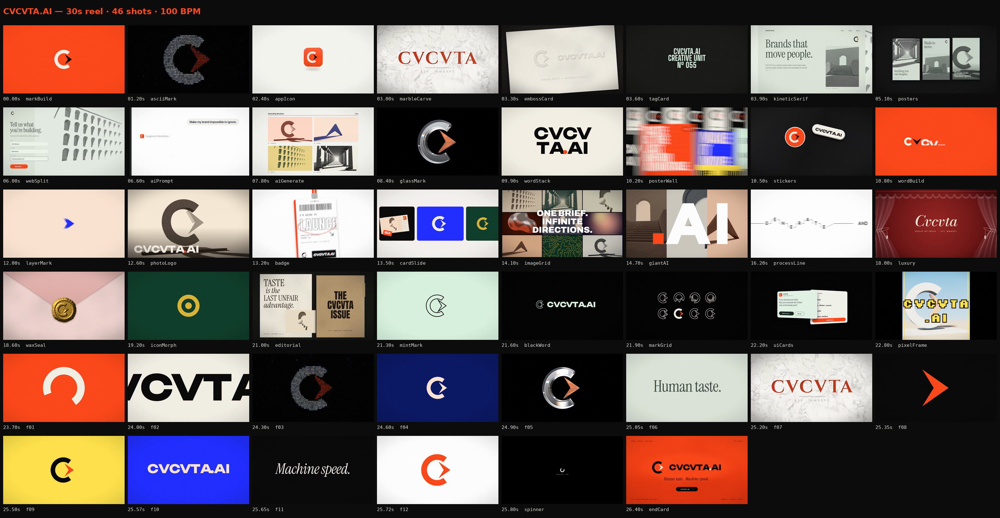

# CVCVTA.AI: 30-second motion reel

A 30-second agency sizzle reel for **CVCVTA.AI**, built entirely in code. Every
frame, texture, 3D render and sound comes from this folder. There is no stock
footage, no samples and no generative-video service. The edit follows the
structure of a branding-agency showreel: rapid beat-locked cuts, one brand world
per segment, logo builds, kinetic type, print and UI mockups, glass and glitch.

**Output:** `out/CVCVTA_reel_1080p.mp4` (1920×1080, 30 fps, H.264 High, BT.709, AAC 320k, 30.0 s)



## The identity

| | |
|---|---|
| **Mark** | A C-ring whose open mouth holds a forward "play" chevron: the V of CVCV turned into motion. The ring also works as a loading spinner. The edit uses this idea: the reel ends with a spinner that settles into the mark. |
| **Wordmark** | `CVCVTA.AI` in Unbounded 800, with a vermilion dot. The expressive lockup swaps the first C and V for the ring and chevron. |
| **Palette** | Ink `#0B0B0C`, Paper `#F2EEE5`, Vermilion `#FF4A1C`. Vermilion is the red minium once painted into carved Roman capitals. It nods to the Latin V-for-U spelling. |
| **Line** | *Human taste. Machine speed.* |

## Edit (100 BPM: 1 beat = 0.6 s = 18 frames)

| Time | Segment | What happens |
|---|---|---|
| 0.0–3.6 | Intro | The mark assembles with construction guides. It dissolves into CRT/ASCII code and dives through a glyph. It spins onto a home screen as an app icon, then appears carved in vermilion-painted marble and blind-embossed on paper. |
| 3.6–8.4 | Identity | The drop. Kinetic serif headline on a site built over dithered architecture, sliding posters and a brief form. An AI prompt UI generates four directions out of noise. |
| 8.4–13.2 | Craft | Raymarched glass mark with dispersion and a glitch breakup, stacked wordmark, a whip-panned poster wall and sticker slaps. The mark unfolds into the wordmark. Then layered echo chevrons and a campaign billboard. |
| 13.2–18.0 | Campaigns | Lanyard badge, card carousel and a "One brief. Infinite directions." grid. Giant `.AI` built from fragments, then the IMAGINE → GENERATE → LAUNCH circuit line. |
| 18.0–22.8 | Heritage / system | Line-art theatre frame, a gold wax seal with the mark stamped in, and play/pause/record/stop icon morphs. Then editorial print and a rapid run of brand frames. |
| 22.8–26.4 | Finale | Pixel-type photo frame and a 12-cut flash montage that accelerates from 1/8 to 1/32 notes. A black "loading" beat follows. |
| 26.4–30.0 | End card | The spinner settles into the mark and the lockup, tagline and CTA reveal over a live halftone field. |

Stop-downs (full musical silence) land half a beat before each section drop. The
music and the visuals share one timeline, and all 95 sound-design cues come from
the scenes themselves.

## How it's built

- `src/`: a small deterministic motion engine. Every frame is a pure function
  of time, drawn with Canvas 2D and WebGL2 inside headless Chromium.
  - `timeline.js`: the edit decision list (shots in beats).
  - `scenes/*.js`: one module per section, one factory per shot.
  - `gl.js`: motion-blur accumulation (linear-light subframes) and the finishing
    pass (grain, chromatic aberration, glitch, barrel, vignette).
  - `shaders.js`: raymarched "architectural photography", the glass mark,
    marble, the wax seal, halftone, dither/duotone.
  - `brand.js`: mark and wordmark geometry.
- `render.mjs`: serves the page, drives parallel Chromium workers, and streams raw
  RGBA frames over WebSocket into ffmpeg.
- `audio/compose.py`: the original soundtrack. It is a 100 BPM D-minor track
  (808, claps, trap hats, detuned stabs, a plucked hook, risers) plus the sound
  design. It is synthesized with numpy/scipy, gain-staged per bus, and mastered
  to −1 dBFS.

## Render

```bash
cd reel
npm install                      # playwright + fonts (@fontsource) + ws
pip install numpy scipy pillow imageio-ffmpeg
node render.mjs cues --out out/timeline.json          # export sound cues
python3 audio/compose.py out/timeline.json out/mix.wav
node render.mjs video --w 1920 --h 1080 --mb 6 --workers 4 --keep 1 \
  --audio out/mix.wav --out out/master.mp4                # CRF master, keeps lossless segments
```

The delivery file is a 2-pass, 12 Mbps encode from the kept lossless segments.
It is converted and tagged BT.709 so the vermilion decodes exactly:

```bash
cd out && V='-map 0:v -vf scale=out_color_matrix=bt709:out_range=tv,format=yuv420p -colorspace bt709 -color_primaries bt709 -color_trc bt709 -color_range tv -c:v libx264 -preset slower -profile:v high -level 4.1 -b:v 12M -maxrate 18M -bufsize 24M -r 30 -g 60'
ffmpeg -f concat -safe 0 -i segs.txt $V -pass 1 -an -f null /dev/null
ffmpeg -f concat -safe 0 -i segs.txt -i mix.wav $V -map 1:a -pass 2 -c:a aac -b:a 320k -movflags +faststart -shortest CVCVTA_reel_1080p.mp4
```

Useful while iterating:

```bash
node render.mjs stills --w 1920 --h 1080 --mb 4 --times 3.9,9.0,27.5   # PNGs in out/stills
node render.mjs video --w 960 --h 540 --mb 1 --out out/preview.mp4      # ~1.5 min preview
python3 audio/analyze.py out/mix.wav out/spectrogram.png               # check the mix visually
python3 sheet.py 'out/stills/*.png' out/sheet.png 3                    # contact sheet of stills
```

`--w 3840 --h 2160` renders a 4K master. The scenes are resolution-independent.
Procedural images are baked once to `assets/baked/`, which is a cache that
rebuilds when a shader changes.
